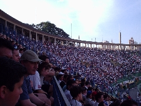
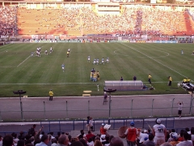
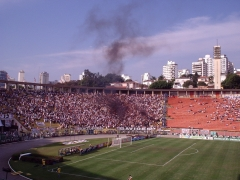
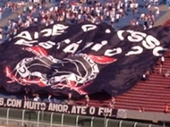

  <em>Fotos: Adriana Garcia</em>

**A EXPERIÊNCIA **

[][1]Nunca me interessei por futebol. Não vou ser o primeiro nem o último nerd a dizer isso, mas o meu caso é crônico: não jogo bola, não acompanho campeonato, não assisto jogo na TV, nem copa do mundo eu vejo. O mais perto que eu cheguei foi gastar uma meia horinha no Winning Eleven (e mesmo assim só porque era da Konami).

Mas eu sou, acima de tudo, um cientista. E neste espírito científico aceitei o convite de dois queridos amigos para ver um jogo no estádio, e tentar entender (ou ao menos sentir um pouco) a paixão nacional. Sendo meu amigo corinthiano e minha amiga gremista, nada mais natural que prestigiar o [Corínthians x Grêmio][2], que aconteceu no Estádio do Pacaembu em 21/Ago/2004.

TV VERSUS ESTÁDIO

Eu não sei se um dia vou me apaixonar por futebol, mas uma coisa é certa: nunca mais vou conseguir assistir a um jogo pela televisão. Não é a mesma coisa. Ter a visão do campo todo é ótimo e, ao menos no lugar onde eu estava, dá pra acompanhar numa boa todos os lances, mesmo sem replay.

Fica a impressão de que assistir um jogo desses pela TV é como navergar nesses sites com barra de rolagem horizontal &#8211; com a desvantagem que você não controla a barra. Além disso, por menos que eu conhecesse os jogadores ou detalhes das regras, é **muito** melhor acompanhar sem a narração.

<table width="90%" align="center">
  <tr>
    <td colspan="3">
      

    </td>
  </tr>

  <tr>
    <td align="center">
        A torcida
    </td>

    <td>
    </td>

    <td align="center">
        Momento do gol do grêmio
    </td>
  </tr>

  <tr>
    <td colspan="3">
      

    </td>
  </tr>
</table>

**VALE-TUDO**

Apesar do chavão dizer que &#8220;a regra é clara&#8221;, aparentemente, a sua aplicação não o é. Sei que não é fácil ser árbitro, mas isso não muda os fatos: de cada cinco decisões, uma é altamente discutível &#8211; e isso para mim, que não tenho o mínimo olho clínico.

A apoteose do absurdo é a cobrança de lateral, na qual os jogadores demonstram seu lado nômade. Teve uma hora na qual eu poderia jurar que o cara avançou uns três metros em relação ao ponto de onde a bola saiu, e o árbitro não se abalou. Agora sei porque os desportistas se irritam quando chamamos este profissional de &#8220;juiz&#8221;: nem o nosso judiciário, com todas as suas mazelas, é permissivo assim.

Se o árbitro deixa passar qualquer coisa, a torcida, por outro lado, é implacável. Num momento meio tenso, em pleno ataque, o jogador corinthiano deixou de pegar a bola que estava saindo, achando que a lateral seria do seu time quando, na verdade, era do adversário. Foi vaiado à exaustão, me lembrando de quando passei pela mesma situação (é, eu era obrigado a jogar no ginásio). Nego me olhou torto por dias a fio.

**TORCIDAS ORGANIZADAS**

No caso, só estavam as do Corínthians &#8211; os torcedores gremistas ficaram confinados em um canto do estádio (exceto minha amiga, cujo ânimo eu tentava refrear a todo custo, temendo a reação da turba). A bateria era bastante cadenciada e incansável, o que me impressionou.

Num dado momento, sugriu uma fumaça preta (não sei se era algum tipo especial de gelo seco ou o quê), produzida pela Gaviões da Fiel. Passado o susto (achei que já estavam incendiando tudo), me resignei a admirar: os caras se preparam bem. Tanto eles quanto a Camisa 12 estendiam bandeiras cobrindo a arquibancada, sendo que uma delas (estendida no &#8220;tobogã&#8221;, a desprestigiada área atrás do gol no Pacaembu) reivindicava o eternamente prometido estádio do Corínthians.

Dizem os entendidos que um jogo &#8220;em casa&#8221; é forte vantagem. De fato, a torcida se empolga: xingam o adversário, o juiz e os jogadores do próprio time. Eu sou meio profissional nessas horas (uma vez o Maluf foi participar de um chat no iG e eu mantive a compostura &#8211; mesmo quando ele veio &#8220;ganhar o meu voto&#8221;), mas imagino que deva incomodar. Ao menos a hostilidade se limitou ao campo verbal.

<table width="90%" align="center">
  <tr>
    <td colspan="3">
      

    </td>
  </tr>

  <tr>
    <td align="center">
        Efeito de fumaça preta. Macabro.
    </td>

    <td>
    </td>

    <td align="center">
        Faixa de protesto: &#8220;cadê o nosso estádio?&#8221;
    </td>
  </tr>

  <tr>
    <td colspan="3">
      

    </td>
  </tr>
</table>

**INFRA**

Eu já esperava que os preços no estádio, embora ainda populares, fossem além do razoável. O que me surpreendeu foram as marcas looser de todos os produtos &#8211; com o destaque para um sorvete que tinha como slogan &#8220;Sorvetes Fiesta &#8211; o que é bom pra você&#8221;. **Aquilo** era bom pra mim? Não precisa pisar também, puxa vida.

Pelo menos os vendedores estavam disponíveis a qualquer hora. Também vendiam hot-dogs, e eu fiquei imaginando quem consegue comer um hot-dog naquele calor. Além disso, havia a famosa cerveja no copo de plástico (que não se transforma em arma). Dispensei ambos, já passei suficientemente mal com o calor (mesmo na sombra).

**CONCLUSÃO**

É uma experiência incrível &#8211; e olha que eu não me envolvi muito (tá, eu acabei me solidarizando e torcendo para o Grêmio, mesmo eles jogando com 12 homens na defesa). Acho que todo mundo tem que fazer isso uma vez na vida, e recomendo fazê-lo num lugar bom como o que eu peguei (nas numeradas, próximo do meio) e com companhia experiente e agradável como a que eu tive. Porque mala em estádio é o que não falta, eu vi um monte.

Finalmente, aproveito o momento para pedir desculpas publicamente ao Juan, que saiu frustradíssimo porque eu não soltei um mísero palavrão&#8230;

 [1]: /img/estadio/tres_g.jpg
 [2]: http://lancenet.ig.com.br/idxn.asp?f=/news/news_lft.htm&p=/noticias/04-08-21/FUT/JOG/L273800.htm
