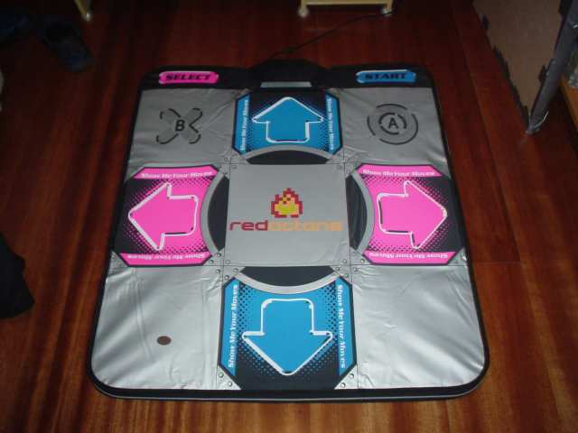
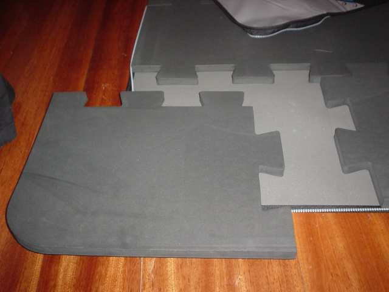
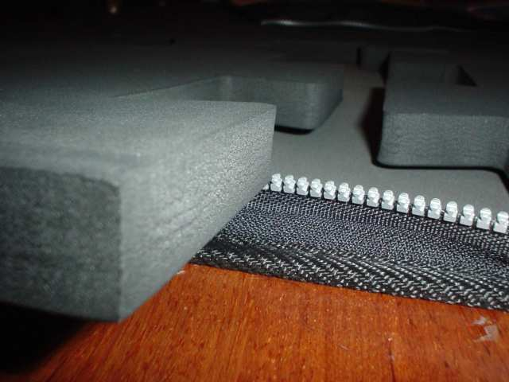
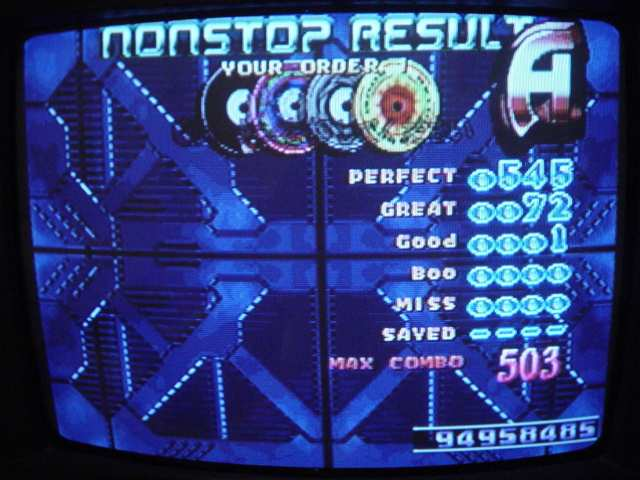

Todo jogador de [Dance Dance Revolution][1] sonha em ter uma máquina na própria casa. O motivo para isso é que os tapetes de dança para PlayStation são propensos a falhas, desconfortáveis, barulhentos e de baixa durabilidade. Isso leva alguns jogadores a fazer modificações nos seus tapetes (até eu fiz [uma][2]), com resultados variados.

Algumas empresas vendem plataformas de metal semelhantes à máquina, mas além de caros, são pesados, o que torna o custo de trazer para o Brasil um pouco proibitivo. Tive a felicidade de ter um amigo nos EUA que experimentou o [RedOctane Igntion 2.0 Pad][3], e gostou tanto que não só me convenceu a comprar um como fez a gentileza de trazê-lo para mim em sua última visita ao Brasil.

Estou com o brinquedo há algumas semanas, mas só escrevi agora porque a minha primeira impressão foi tão boa que tive medo de estar com a &#8220;síndrome do trenzinho novo&#8221;. O fato é que eu não estava: o tapete é mesmo fantástico! Pra começo, ele tem uma camada de espuma sintética de uns 2cm de espessura. Essa camada vai por dentro do tapete (que abre com um zíper) e é montada como se fosse um quebra-cabeças.

Ela garante \*muito\* conforto ao jogar &#8211; diria que é tão bom quanto a combinação máquina de fliperama + tênis com amortecimento decente &#8211; só que é muito mais confortável jogar de meia (e em casa, onde dá para usar roupas mais leves). É quase uma massagem nos pés, só que sem os [riscos][4] que a prática oferece.

Em termos de jogabilidade, ele te dá a vantagem de sensores maiores (ou seja, ele reconhece quando você pisa &#8220;de canto&#8221;). Além disso, as setas possuem uma camada extra de espuma, o que dá uma vantagem que antes só existia na máquina: é possível &#8220;sentir&#8221; onde estão as setas, sem olhar para baixo. Só pisando nele dá pra entender o quanto isso muda a vida.

Na prática: dá pra jogar com menos dor nos pés, e as pontuações tendem a aumentar. Nada que te leve de jogador casual a atleta olímpico, mas eu não costumava fazer combos como o da foto com tapetes tradicionais. O mais importante, no meu caso, é que e o tapete estimula o exercício &#8211; e um exercício de melhor qualidade, graças ao impacto reduzido. Uma boa grana, mas vale.

 [1]: http://www.gamespot.com/ps/puzzle/dancedancerevolution/review.html
 [2]: ../tapete.html
 [3]: http://www.redoctane.com/ignitionpad.html
 [4]: http://www.moviewavs.com/MP3S/Movies/Pulp_Fiction/footmass.mp3
