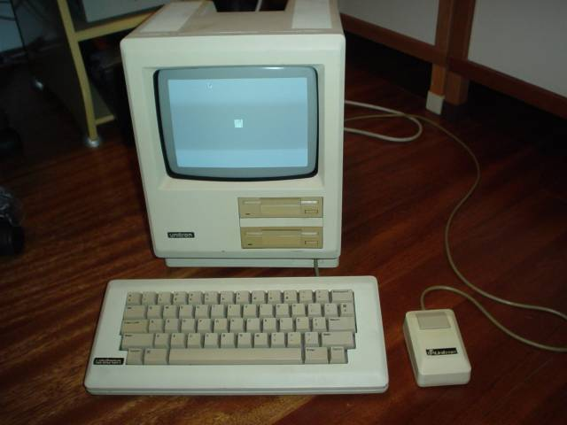
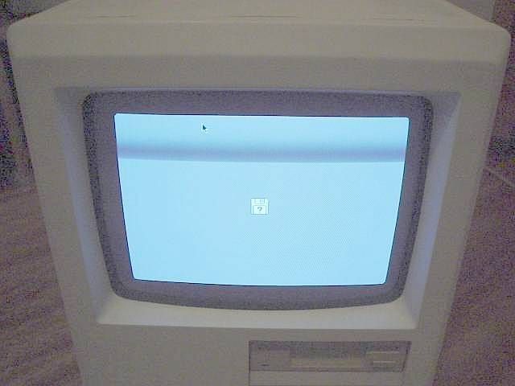
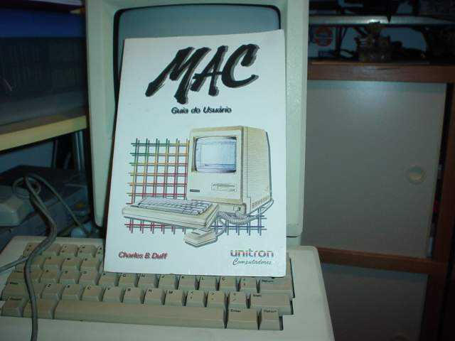
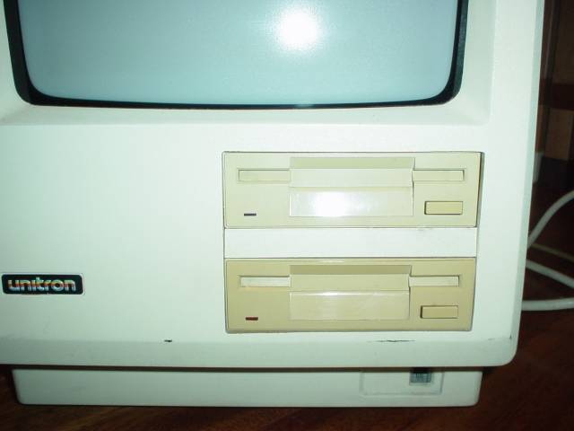
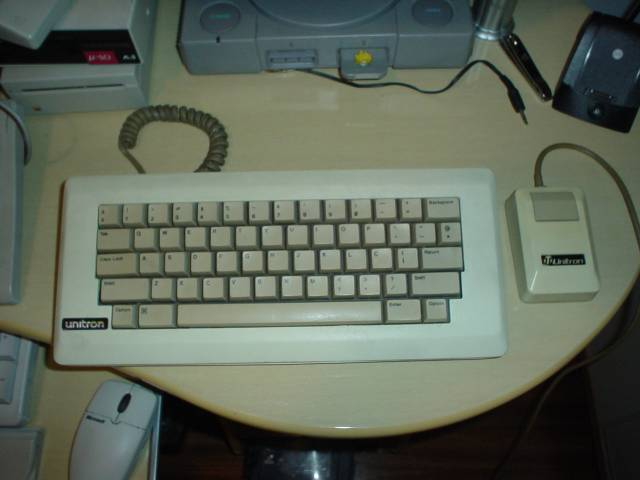
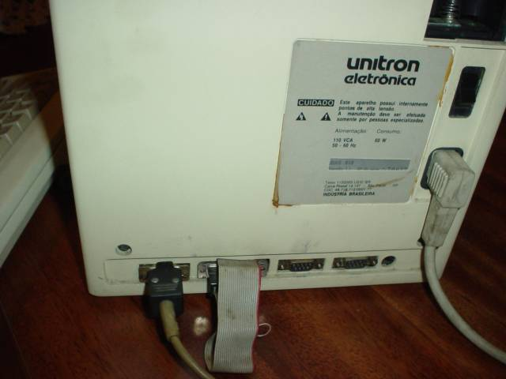
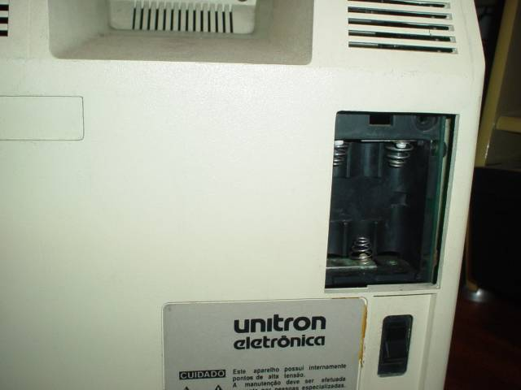
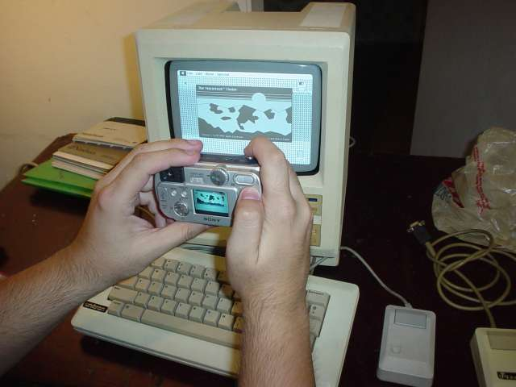

  <strong><em>último update: 14/Mar/2004</em></strong>

Quando a Apple lançou o Macintosh (~1984), ela o projetou de forma a impedir a criação de &#8220;compatíveis&#8221; (ao contrário do IBM-PC). Isto não impediu que a brasileira [Unitron][1] conseguisse a proeza de cloná-lo.

Ele seria lançado no mercado nacional com o nome de Unitron Mac 512, mas, graças a uma intervenção da Apple junto ao governo brasileiro, a empresa foi proibida de comercializá-lo, e se viu obrigada a mudar de ramo (informações [aqui][2] e <a href=http://www.folklore.org/StoryView.py?project=Macintosh&#038;story=Stolen\_From\_Apple.txt&#038;showcomments=1">nos comentários deste post</a>). Sempre se ouviu rumores de que algumas unidades haviam sido fabricadas e ainda existiam por aí.

Uma [edição recente da revista MacMania][3] tratou do caso, reacendeu o interesse no assunto, e **eu consegui descolar um**! O melhor é que, mesmo não tendo conseguido ligá-lo no PC, consegui vários disquetes dele e coloquei pra funcionar. Eis as fotos:

    O micro ligado. Ele existe mesmo, e até funciona!

    Infelizmente ainda não tenho os disquetes do sistema (e nem consegui determinar se é preciso um disquete de ROM), assim, tudo o que ele faz hoje é pedir um disquete.

    Tem até um manual &#8211; bastante detalhado, explica até como funciona o monitor de vídeo.

    A frente do computador. Tem dois drives e um conector de teclado estilo &#8220;telefone americano&#8221;. O mouse vai atrás, com um conector pré-ADB (Apple Desktop Bus, o padrão dos Macs antigos e do <a href="../iigs.html">Apple II<tt>GS</tt>)</a>. Este era o conector dos Macs originais (informação cortesia do André Ferreira).

    Um close no teclado e no mouse, ambos personalizados, da própria Unitron. O mouse lembra um pouco o do Lisa. O teclado tem Caps Lock mecânico e layout em português (com &#8220;ç&#8221; e acentos).

    Atrás tem vários conectores: mouse, duas seriais e um conector para drive externo, com um cabo flat indo para dentro do micro. Acho que o segundo drive deve estar ligado nele.

    Detalhe: ele tem um compartimento para pilhas (grandes?) &#8211; para guardar o horário e &#8220;outras informações&#8221;, segundo o manual.

    Descolando alguns disquetes, deu pra brincar um pouco com o bicho. Essencialmente, é um Fat Mac. Levei-o ao 2o. encontro do Grupo de Usuários de Apple II (a foto acima foi feita lá), e em breve o <a href="http://www.apple2.com.br/">site</a> do grupo terá várias fotos (e filmes) do Mac 512, inclusive desmontado. Não percam.

 [1]: http://www.unitron.com.br/
 [2]: http://www.lowendmac.com/clones/unitron.html
 [3]: http://www.terra.com.br/macmania/macmania/indice.htm
