

  Em 1998 eu colecionava micros de 8 bits. A coleção já era, mas ficaram as fotos:

  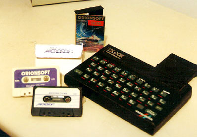  Meu <strong>TK90x</strong>, com algumas fitas e um cartucho com um chip de som  bacana, que deixava o Tetris comparável ao do fliperama

  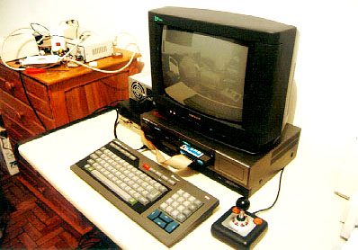 <strong>  Expert </strong> ligado num televisor, com um joystick modernoso e um drive  de 5 1/4 de PC (note que a fonte também era de PC). Cool !

  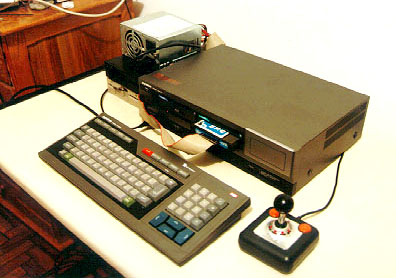  O mesmo <strong>Expert</strong><strong>, </strong>sem o televisor

  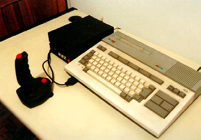  Um <strong>Hotbit </strong>com um Dynastick (coisa de boy no tempo do Atari)

  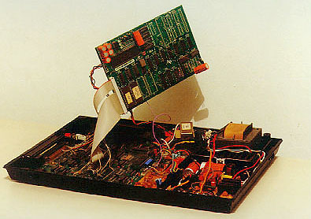  O <strong>Hotbit </strong>desmontado (a placa em destaque era o &#8220;Kit 2.0&#8243;)

  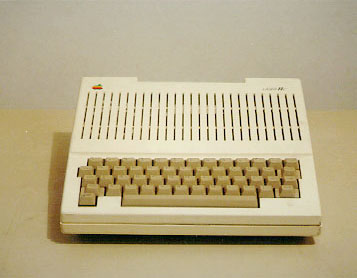  <strong>Laser //c</strong>. Quando eu comprei, achei que era uma versão  tupiniquim do Apple //c, mas internamente era um Apple ][+.  Frustrante para quem já viu um TK3000//e Compact&#8230;

  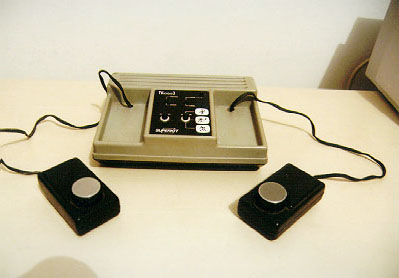  O que esse <strong>TV Jogo</strong> estava fazendo lá em casa ? Sei lá, mas  que combinava perfeitamente com a coleção, isso lá era verdade&#8230;

  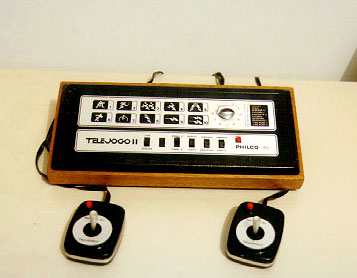  E, no melhor estilo &#8220;<a href="http://www.ignore.com.br/fuscas/primeira.htm">onde tem um fusca tem outro</a>&#8220;, eis um <strong>Telejogo II</strong>

  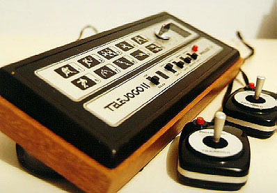  Um ângulo mais ousado para o <strong>Telejogo II</strong>

  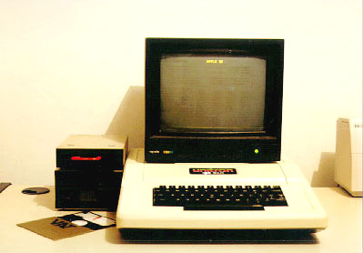  Ah, quem disse que não funciona ? Tá lá o<strong> Unitron ap II</strong> em plena atividade.  Conheço muito veterano de informática que começou num desses&#8230;

  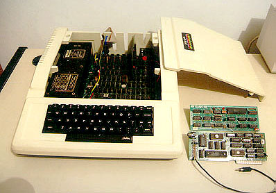  O <strong>Unitron </strong>visto por dentro. Dizem que quem viu um Apple II viu todos  (também, como melhorar um gabinete desenhado pela Apple ?)

  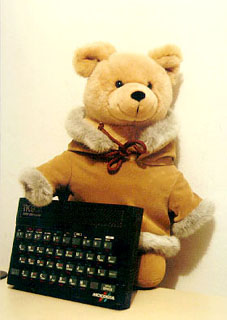  Mas o que é isso, minha gente ? Trata-se do  <strong>Pimpão</strong>, o ursinho micreiro. Um dia eu acho as  fotos da biografia não-autorizada dele, é hilária.

