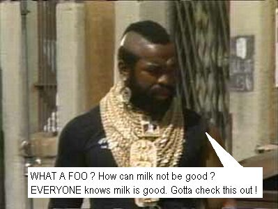

I got so pissed off for having to fix mistakes left by some &#8220;top five&#8221; IT consulting companies in recent times that I decided to use them in my first contribution to the &#8220;Mr. T Versus&#8221; scene (more details [here][1]).

Images were mostly grabbed from other &#8220;Mr. T versus&#8221; sites (special credits to [Mr. T vs. Turok][2] for the last picture), and also from [Philip C. Robinson&#8217;s site][3]. The artwork is crappy, as it should be. Since English is not my first language (neither regular English nor Mr. T&#8217;s), there may be a few mistakes.

Feedback is welcome. And let&#8217;s go to the story&#8230;

* * *

  Mr. T, as usual, is sharing his wisdom with the kids at the youth center.

  

* * *

  However, it seems that somebody visited the kids beforehand&#8230; somebody evil.

  

* * *

  Mr. T did NOT like it&#8230;

  

* * *

  &#8230;and, of course, he decides to investigate.

  

* * *

  Now he will face the worst crap in the face of earth: consulting salespeople.

  

* * *

  They try to fool our hero (but, anyway, they try to fool everyone).

  

* * *

  Do you believe there are companies that actually spend money to hear crap like that ?  Sadly, they exist. And they spend a <strong>lot</strong> of money&#8230;

  

* * *

  Hmmm, bad move. Everyone knows that Mr. T&#8217;s gold chains are untouchable.

  

* * *

  Is this guy nuts or what ? I guess it&#8217;s throw time.

  

* * *

  Thank you, Mr. T. Unfortunately, those suit bozos never learn&#8230;

  

* * *

  In the end, our hero shows the kids that if you have a minimum self-respect  you don&#8217;t need other people to do your job.

  

* * *

 [1]: http://www.mrtvseverything.com/MrTvs.html
 [2]: http://tsc.itgo.com/story/mrt/intro.htm
 [3]: http://www.inzenity.org/mrt/index.html
