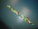

Começou com pequenas doses, vendidas em pacotinhos perto do meu caminho. Daí foi crescendo, crescendo, e hoje minha mesa de trabalho (isso sem falar nas mesas ao redor da minha) é um verdadeiro mar de [Pinos Mágicos][1] &#8211; uma espécie de Lego com preços viáveis para a Vila Ema.

Como as coisas têm que ser desmontadas para dar lugar a coisas novas, resolvi tirar fotos das mais bizarras/divertidas/trabalhosas e postar aqui. Clique nos thumbnails para ampliar:

* * *

  <strong>PODEROSA ESPADA</strong>

Essa espada ficou show. Depois de dúzias de brinquedos que desmontavam logo no início da brincadeira, passei várias compilações imaginando um que fosse mais resistente. O resultado: a espada chega até a &#8220;torcer&#8221; (como uma lâmina fina) quando você balança, mas não quebra &#8211; mesmo depois de várias sessões de pancadaria. Deu dó de desmontar.

       

* * *

  <strong>LOGOTIPOS</strong>

Eu sei, é bem pelego, mas fazer o que ? Eu vejo esse logotipo umas 800 vezes por dia &#8211; e tenho que admitir que ele é simpático. Quando eu vi já estava montando ele. Pena que justo pra cor atual (ele já foi vermelho, hoje é azul) faltou peça.

       

* * *

  <strong>MONTANHA RUSSA (EM CONSTRUÇÃO)</strong>

Ganhei um kit de pinos mágicos que me revelou o universo das peças curvas e das rodas. Algumas poucas experiências bastaram para mostrar que tais peças viabilizam uma idéia antiga: criar uma montanha russa de pinos mágicos.

Ainda nem bolei direito, mas a primeira &#8220;prova de conceito&#8221; ficou tão bacana que coloquei a foto e os dois filmes abaixo, pra dar um aperitivo do que será o resultado final (e também para me forçar a concluir).

  

* * *

 [1]: http://www.elka.com.br/lancamentos/2002/pinos100.htm