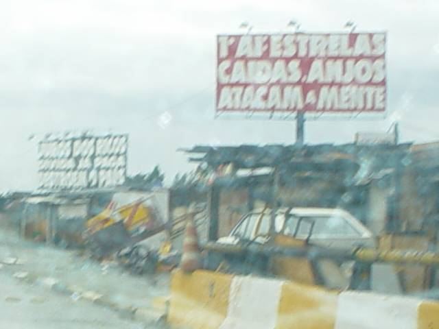

De uns dois anos pra cá, começaram a surgir outdoors **muito** estranhos na Marginal Tietê (via expressa que corta São Paulo). Um dos mais antigos tinha a inscrição &#8220;TELEVISÃO &#8211; IMAGEM DA BESTA&#8221; (com o &#8220;B&#8221; imitando chifres), mas logo surgiram outros.

Não há logotipo, nome de entidade, nada &#8211; apenas letras brancas em uma fonte chamativa, com fundo vermelho ou preto. Parecem tentar alguma espécie de pregação, mas o idioma utilizado é completamente desconhecido para mim &#8211; as frases são tão desconexas que é difícil até memorizá-las para contar a alguém.

Naturalmente, acabei fotografando algumas. Se alguém tiver alguma idéia do que diabos significam, ou de quem se dispôs a colocá-las sem se identificar, sou todo ouvidos.

* * *

  

  Como assim? Se eu praticar idolatria, terei morte causada por chagas, é isso?  E quem é a besta ferida? Eu? Mas não estava morto, que importa ser ferido?  Existe religião que não pratique idolatria? Seria esta uma propaganda pró-ateísmo?  Boiei.

  

    
  

  

    Vai ver é a omissão das vírgulas, preposições e verbos de ligação que atrapalha.  Se mudarmos para &#8220;Pregação, filhos, é a chave&#8221;, faz algum sentido &#8211; ao menos gramaticalmente.
  

  

  

    

      
    

    

      O incrível é que as frases mais antigas, como esta, até que fazem algum sentido.  Mas ainda é impossível não esboçar um sorriso ao ver o &#8220;B&#8221; com chifrinhos.  Ah, saquei, é uma estratégia para detectar pecadores como eu!
    

    

    

      

        
      

      

        Infelizmente, minha foto predileta não ficou muito boa. Mas lê-se: &#8220;1o. AI: ESTRELAS CAÍDAS,  ANJOS ATACAM A MENTE&#8221; e &#8220;JUROS DOS RICOS / DÍVIDA JÁ PAGA / DESTROEM O PAÍS&#8221;.
      

      

        Caramba, eu devo ser muito ignorante. O que é (ou foi) o primeiro &#8220;AI&#8221; ? E como é que o  assunto pulou de religião para geopolítica? Ah, desisto, vou ver Friends que eu ganho mais&#8230;
      

    

  

