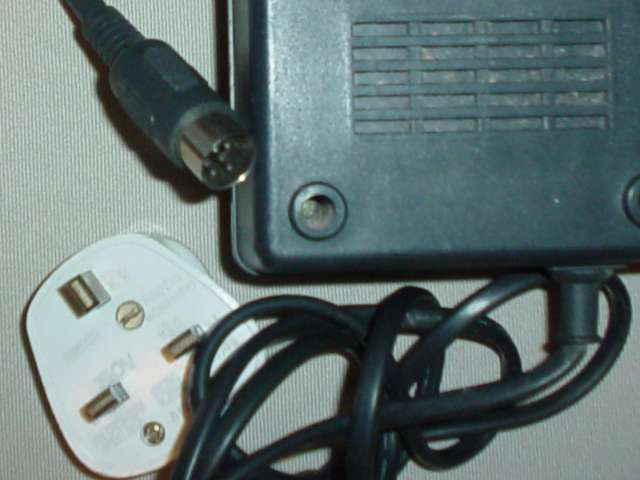

  <strong><em>último update: 07/Jul/2010</em></strong>

  É, a gente se empolga. A aventura do <a href="../iigs.html">TupperWare GS</a> me abriu o caminho das pedras para as compras no eBay. Micros que foram muito populares nos EUA são vendidos baratinho por aquelas pradarias, mas, fora o Apple, pouca coisa de lá me interessava.

Nos anos 80, usei bastante o TK90x, clone do ZX Spectrum inglês. O Spectrum foi um sucesso estrondoso no seu país de origem, tendo novas versões lançadas até o final da era 8 bits. Optei pelo modelo &#8220;+2&#8243;, que contava com chip de som e 128KB de RAM &#8211; fora o gravador cassete embutido, que é meio perdedor por não ter contador de giros, mas absolutamente kitsch ! :-)

Fechei o leilão, aquela história toda, e três meses e meio depois, quando eu já tinha dado como perdido, chegou o pacotão. Ainda não liguei, mas já tirei algumas fotos:

    O gabinete estava bem sujinho. Baixou a Dona Dita e limpei, tecla por tecla.

    Valeu o esforço: agora dá pra usar sem medo de grudar os dedos. Fala se esse não era o sonho de qualquer micreiro dos anos 80 (o micro, não os vasinhos da minha ex-esposa).

    Por falta de expansão é que ele não fica obsoleto: impressora, teclado MIDI, joysticks, RGB, tudo built-in (nesse sentido, lembra muito o II<tt>GS</tt>):

    Na foto acima é que se vê porque eu não liguei ainda: a fonte do bicho não só é de 220V, como usa esse conector bizarro. Usar uma fonte própria não vai ser muito trivial: ele tem sinais de 5V e 12V (tou vendo que vou ter que mandar ver outra fonte de PC).

Acabei passando esse micro adiante, mas foi uma compra legal.