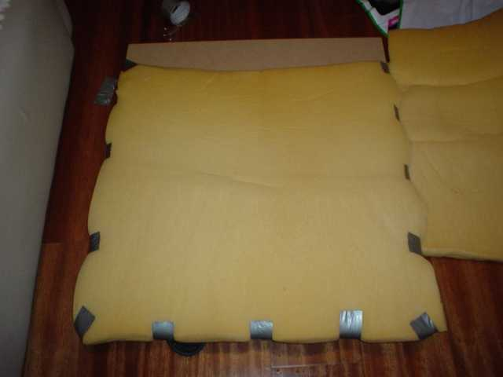

[Dance Dance Revolution][1] (DDR, para os íntimos) é um dos mais inovadores jogos do PlayStation &#8211; além de ser extremamente divertido, obriga os nerds de plantão a mexerem seus traseiros gordos. No entanto, os tapetes de dança doméstico não são a oitava maravilha &#8211; eles começam a falhar depois de um tempo, e não são confortáveis como os botões da máquina de fliperama (por não terem as molas).

Existem tapetes metálicos lá fora, mas, além da questão do preço, o envio e os impostos inviabilizam a importação. O que muita gente tem feito é &#8220;reforçar&#8221; os tapetes, e eu resolvi fazer o mesmo. Achei interessante relatar a minha experiência aqui &#8211; talvez ela ajude alguém a fazer o mesmo, como outros sites me ajudaram.

Meus principais modelos foram a modificação de tapete do [theGreenZebra][2] (autor do pyDance, um programa estilo DDR feito em Python) e a do [PitterPanda][3], do site DDRFreak. Não importa o que você for fazer, é preciso começar com uma base de madeira. Isso é fácil, você manda cortar no tamanho em qualquer marcenaria (eu fui [aqui][4] e recomendo).

  

O theGreenZebra reforça o enchimento de espuma dos botões do tapete, abrindo-o. Gostei da idéia, mas eu tenho uma mão santa pra estragar essas coisas. Resolvi colocar o reforço sob o tapete &#8211; e radicalizei, colocando sob **todo** o tapete. Essa espuma é um inferno pra achar, mas eu tive sorte: havia um colchão (desses de camping, bem fininhos) em frangalhos aqui em casa. Abri e usei a espuma dele &#8211; recortei no tamanho do tapete e fui fixando com Silver Tape.

  

A idéia do PitterPanda foi usar um pedaço maior que o tapete, prendendo-o com um plástico e uma pistola-grampeador. Eu achei melhor usar uma madeira exatamente do tamanho do tapete, mantendo a coisa compacta. Para evitar acidentes, &#8220;enrolei&#8221; a espuma em torno do tapete. Isso é importante, pois o canto vivo da madeira pode te machucar quando você estiver só de meia.

  

Feito isso, é colocar o tapete em cima e fixar, também com Silver Tape. O ideal é ir fazendo e experimentando. Descobri que, se você fixar muito forte as laterais, acaba causando o &#8220;efeito quinto botão&#8221;, i.e., ao pisar no meio a espuma acaba acionando a seta esquerda ou direita. Resolvi isso deixando as laterais soltas. Fica meio esquisita aquela &#8220;falha&#8221; na parte prateada, mas a vida é dura. Eis o resultado final:

  

Na verdade, eu fiz outras experiências depois disso. Por exemplo, tentei grampear o plástico. O problema é que isso acabava causando novamente o problema do quinto botão. Pra evitar isso, o único jeito que encontrei foi colocar uma madeira no centro, como o theGreenZebra fez (ele queria que o centro fosse mais alto, como na máquina). Até dava certo, mas, juntando esta madeira com a espuma extra (para evitar machuar o pé), ficava \*muito\* alto. Joguei umas músicas, não gostei e voltei tudo como estava.

A brincadeira girou em torno de R$ 45, entre madeira e Silver Tape. Talvez mais uns R$ 5 ou 10 se eu fosse comprar a espuma, sei lá (se alguém achar isso em algum lugar pra vender me avise). Se você for fazer o lance do plástico, vai gastar mais uns R$ 30-40 numa pistlola-grampeadora (caso não tenha). De qualquer forma, um tapete novo custa na faixa de R$ 50, ou seja, em qualquer caso se dobrar o tempo de vida do tapete já valeu a pena.

É importante lembrar que cada modificação de tapete procura resolver falhas específicas. No meu caso, eu queria:

*   prolongar o tempo de vida do tapete;
*   impedir que ele escorregasse;
*   diminuir o &#8220;impacto&#8221; da pisada (embora valha lembrar que, de qualquer forma, não é bom para a saúde nem para a performance pisar muito forte).

Estou satisfeito, pois consegui tudo isso, e ainda tive um bônus: a vibração que eu faço dançando diminuiu sensivelmente. Acho até que dá pra jogar à noite sem incomodar meu vizinho de baixo. Se você quiser tentar fazer igual, valem os avisos de sempre: você pode danificar seu tapete, perder um dedo, morrer eletrocutado, o risco é seu. Eu arrisquei e não me arrependi. Boa sorte!

 [1]: http://www.gamespot.com/ps/puzzle/dancedancerevolution/review.html
 [2]: http://clickass.org/%7Etgz/pyddr/hardmat/
 [3]: http://www.ddrfreak.com/library/faqs-modding.php/
 [4]: http://www.pegfaca.com.br/