***último update: 07/Fev/2004***

O TK85 era conhecido como o Fusca dos computadores pessoais dos anos 80, surpreendendo pelo que era capaz de fazer com seu tamanho e preço reduzidos. Ele usava fitas cassete para gravar e recuperar programas (compatíveis com o ZX81 inglês).

  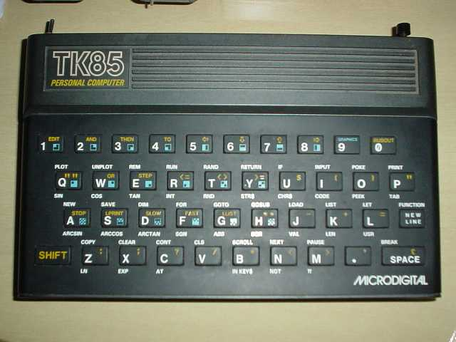

O meu já veio incrementado com a opção de video inverso (chave metálica à esquerda) e o RESET (botão preto à direita). Faltava, contudo, a fonte, e eu perdi um bom tempo tentando fazê-lo funcionar com essas fontes multi-voltagem vendidas em camelô. Sem chance: o micro até tenta dar um sinal de vida (fazendo pensar que o problema é com a TV), mas não sai disso.

Vale a pena investir cerca de R$ 25 numa fonte boa &#8211; eu comprei a minha na [Nodaji][1], que fica na Santa Ifigênia &#8211; o bairro da eletrônica em São Paulo. A loja tem uma linha de fontes para videogames antigos, e os funcionários fazem adaptações de plug/polaridade na hora, mantendo a garantia (e, se não me engano, o preço também).

  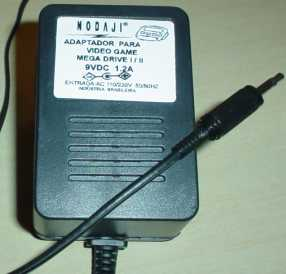

Eles são tão profissionais que até trocam a etiqueta da fonte, para ficar coerente com os novos parâmetros. Eu peguei uma fonte para Mega Drive I/II (9VDC, 1.2A) e pedi para trocar o pino por um &#8220;P2&#8243; e inverter a polaridade (o TK85 tem o positivo no &#8220;pino&#8221; e o negativo na parte externa).

Assim que resolvi o problema da fonte, pude comprovar que é bem difícil ligá-lo em TVs modernas, devido à qualidade ruim do sinal. Felizmente, o Eduardo Luccas bolou o [circuito de video composto para o TK85][2]. A adaptação fica toda dentro do TK, e com ela dá pra em qualquer TV com &#8220;entrada RCA.

A foto é mais pra ilustrar &#8211; o ideal é fazer com fiação menor, e sem inverter as saídas como eu fiz aí (quase fritando o transistor). Tome também cuidado ao abrir a tampa do TK: a membrana que liga o teclado na placa principal é realmente frágil.

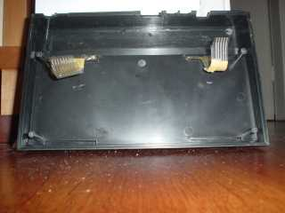 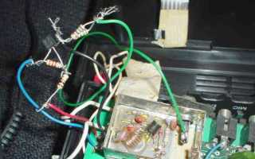

Um parêntese aqui: enquanto eu abria o TK para montar o circuito, descobri que o gabinete do micro era fabricado pela Trol (uma indústria de brinquedos da época). É muita nostalgia para um único dia. Só falta eu ligar o micro e aparecer o [Falcon][3] na tela ! :-)

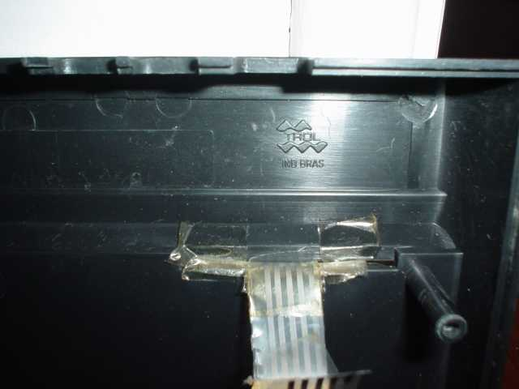

Voltando à vaca fria, a adaptação fica bem na TV, mas só pude tirar fotos de telas usando o TK ligado no meu PC (que tem uma placa de TV, a PlayTVPro). Nesta configuração, a qualidade é apenas tolerável.

Ainda não tenho gravador cassete, logo, teria que usar o PC para carregar programas. Eu ia usar o [ZXTAPE][4], um programa que &#8220;toca&#8221; arquivos .P (usados em emuladores) através da porta paralela. Tem que construir um cabo para ligar a paralela na entrada de gravador cassete do TK, mas é trivial.

Infelizmente, o nível de volume gerado com este circuito é um pouco baixo para o TK85. Como não tinha um amplificador à mão, liguei o bichinho direto nas caixas de som, e usei o p2wav20, do Jader de Amorim, para converter os .P em .WAV, e esses .WAV eu &#8220;tocava&#8221; para o TK pelo WinAmp.

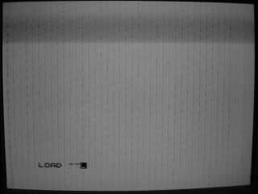 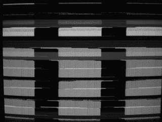

O p2wav20 pode ser descarregado na área de arquivos da [lista tkcp do Y!Groups][5]. Nesta lista podem ser encontrados muitos programas, e, principalmente, muita gente boa para trocar idéias sobre os micrinhos. Eu não teria chegado aqui sem as dicas desse pessoal sangue bom.

Um dos esforços atuais deles é encontrar e digitalizar as &#8220;versões nacionais&#8221; dos jogos (se você tem fitas da época, considere doá-las para os caras: você pode obtê-las em .P, prontinhas para emulador, e preserva a história da microinformática nacional).

Seguem algumas fotos da farra de hoje (em preto-e-branco, o que não faz muita diferença para o TK mesmo):

  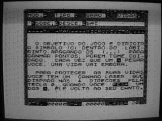 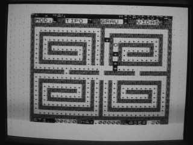

  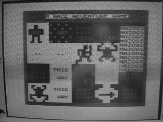 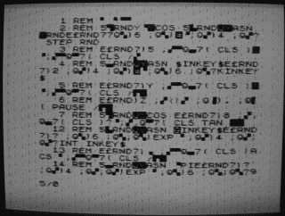

 [1]: http://www.nodaji.com.br/
 [2]: http://sti.br.inter.net/elucas/artigos/TK85-V/
 [3]: http://www.loucoporbonecos.com.br/falcon80/agentesec.htm
 [4]: http://www.worldofspectrum.org/utilities.html#tzxtools
 [5]: http://groups.yahoo.com/group/tkcp/
